# 01. Streaming ingestion to a lakehouse

System design and connection flow: Coinbase → EC2 → S3 → Databricks.

Live BTC-USD ticker events flow from Coinbase to an EC2 consumer, are batched into S3, and are loaded incrementally by Databricks Auto Loader into Bronze and Silver Delta tables. A scheduled job runs the pipeline, a health check watches the consumer, and a Databricks Asset Bundle deploys everything as code.

The build log (phases, commands, issues and fixes) lives in the source repo: [data-engineering-devops-stack](https://github.com/PARESHRANJAN299/data-engineering-devops-stack). This repo is the architecture deep dive.

## Overview

    

This design targets **startup scale**: one stream, modest volume and a small team.

| Advantages | Trade-offs |
| --- | --- |
| Low cost: one small server, S3 and a serverless pipeline | One consumer is a single point of failure |
| Simple to run, debug and explain | One connection caps throughput, and scaling is manual |
| Secure by design and deployed as code, with retries and alerts | Not for high volume or many sources. At that scale use Kinesis and Firehose (see [Scale-up path](#scale-up-path)) |

### Data flow by layer

| Layer | What it does |
| --- | --- |
| **Ingestion** | Python WebSocket consumer on AWS EC2, run as a `systemd` service. It buffers events, writes one JSON batch per flush to S3 with `boto3` using an IAM role (no stored access keys), reconnects with backoff, retries uploads and spools to disk if S3 is unavailable. |
| **Governed access** | Unity Catalog Storage Credential and External Location give Databricks controlled access to the raw S3 data. |
| **Bronze** | Auto Loader (`cloudFiles`) in a serverless Lakeflow pipeline appends raw events to a Delta table, adding the source file and ingestion timestamp. |
| **Silver** | Parses the nested JSON, flattens it to one row per price update, casts to `DECIMAL` and `TIMESTAMP`, enforces four data-quality expectations and removes duplicates. |
| **Operations** | A Databricks job runs the pipeline every 15 minutes with retries and failure email. A separate health-check job alerts if the consumer stops writing to S3. |
| **Delivery** | The pipeline, jobs and schedules are defined in a Databricks Asset Bundle (`dev` target) and deployed from the command line. |

## Connections

    

Every hop is a deliberate connection with its own protocol, access rule and cadence.

- **Least privilege, split by direction.** The EC2 instance can write only under the raw prefix through an IAM role with temporary credentials. Databricks reads that prefix through a separate read-only role. Neither side holds the other's permissions, and no access keys are stored in code.
- **Governed, not open.** Databricks reaches S3 only through a Unity Catalog Storage Credential and External Location, so access is controlled and auditable in one place.
- **Failure rules at every step.** Reconnect and ping on the socket, retries and a disk spool on upload, a checkpoint and quality rules in the pipeline, and retries plus email alerts on the jobs.

## Deep dive: the streaming buffer

    

1. **Receive.** The WebSocket client gets a JSON message for every BTC-USD ticker update and keeps the ticker events.
2. **Buffer.** Events collect in a Python list in memory. The list is capped at 50,000 events, and the oldest are dropped if it ever fills.
3. **Flush.** When a message arrives and at least 15 seconds have passed since the last flush, the buffer is written out as **one JSON-lines file** and emptied. The check runs on each message, so there is no separate timer thread.
4. **Upload.** `boto3` puts the file in S3 under `coinbase/raw/YYYY/MM/DD/HH/`, using the EC2 IAM role, with up to 5 attempts and a growing wait between them.
5. **If S3 is unreachable,** the file is saved to a local spool folder so the buffer cannot grow forever. Spooled files are uploaded after the next successful flush and again at startup.
6. **Stay alive.** A dropped connection triggers a reconnect with backoff from 1 to 60 seconds, a ping every 20 seconds detects silent failures, and a stop signal triggers a final flush. systemd restarts the service if it exits.
7. **Hand off.** Each new file is picked up by Auto Loader into Bronze on the next 15-minute job run.

## Scale-up path

    

One consumer is a single point of failure, one connection caps throughput, the in-memory buffer is lost if the process is killed without a stop signal, and scaling means managing servers.

| Stage | Architecture | Use it when |
| --- | --- | --- |
| **1. Today** | Source → one EC2 consumer → S3 → Auto Loader → Bronze and Silver | One stream, modest volume, small team |
| **2. Harden** | Same flow, with the consumer in a container on ECS Fargate (image stored in ECR), automatic restarts and CloudWatch alarms | Still one stream, but you want automated deploys and no server to look after |
| **3. Large scale** | Producers → **Kinesis Data Streams** → **Amazon Data Firehose** → S3 → Auto Loader → Bronze, Silver, Gold | High volume, many sources, replay and availability requirements |

Kinesis Data Streams scales with shards, keeps data for replay and lets several consumers read the same stream. Firehose takes over what the Python consumer does by hand: buffering by size or time, retrying, optional transformation, and writing partitioned files to S3. For seconds-level latency, Databricks can read from Kinesis directly instead of waiting for files. For one ticker, Kinesis would add cost and moving parts without a benefit. Check current AWS limits and pricing before sizing.

**What to keep when scaling:** raw Bronze, Silver deduplication on a key (streams deliver at least once), data-quality expectations, Asset Bundle deployment and the freshness alert.
