# 01. Walmart data feeds into Databricks

System design and connection flow for pulling Walmart Data Ventures data into Databricks, one feed at a time.

## My feed understanding

    

- **A feed is one particular dataset.** For example, Store Sales holds sales information and Store Inventory holds inventory information.
- **The Databricks code chooses which feed to request.** It does not ask for all Walmart data together.
- **One request, one feed.** If there are 10 datasets and Databricks requests Store Sales, it gets Store Sales data only, not all 10.
- **A second dataset needs a second request,** made to that feed's own endpoint.
- The "10" is only an example. The real number of feeds is not fixed here, and the feed names shown are examples, not a full list.

## Request flow

    

| # | Step | Source |
| --- | --- | --- |
| 1 | Get a bearer token. The client secret is requested from a Walmart Data Ventures account manager or sales engineer. | Documented |
| 2 | Call the **Status** endpoint to check whether the feed is available before requesting it. | Documented |
| 3 | Consume **History** first (mandatory), then **Incremental** on later runs. | Documented |
| 4 | The API returns a **signed URL**. It authenticates by query string, so no extra credentials are needed, and it expires after about 10 minutes. | Documented |
| 5 | Download the file from cloud storage. The format, parquet or ORC, is chosen at onboarding. Large files can be split into several parts, each with its own signed URL. | Documented |
| 6 | Land the files and load them to Bronze, for example with Auto Loader. | **My design choice**, not defined by Walmart |

Other documented facts: the API has four endpoint categories (**Snapshot, History, Status, Incremental**), and incremental and history feeds are kept for a maximum of 45 days. Snapshot feeds use paths of the form `/bulkfeeds/snapshot/<feed>`, for example `dcdimensions`.

## Two ways to receive Walmart data

| Route | How it works | In this folder |
| --- | --- | --- |
| **API data feeds** | Request a feed from an endpoint, receive a signed URL, download files. | Drawn above |
| **Cloud Feeds (Delta Sharing)** | Walmart shares datasets cloud to cloud through Databricks Delta Sharing, with no download step. | Not drawn yet |

## Still to confirm

- Which route Databricks uses in your setup, API data feeds or Cloud Feeds. The flow above is the API route.
- The exact feed names and endpoints available to your account. Store Sales and Store Inventory come from my notes, and I have not confirmed them against the API reference.
- Where the files land (Unity Catalog Volume or S3) and how the job is scheduled.

## Sources

- [Walmart Data Ventures developer docs: Step 5, Downloading Data](https://developer.walmartdataventures.com/scintilla-media-data-feed/docs/step-5-downloading-data)
- [Walmart Data Ventures API v2 docs](https://developer.walmartdataventures.com/apis/v2/docs)
- [Databricks Data + AI Summit: Cloud-to-Cloud Data Sharing by Walmart](https://www.databricks.com/dataaisummit/session/cloud-cloud-data-sharing-walmart-direct-access-omni-channel-sales-data)
