# 02. Walmart operations and methods

Summary of my understanding of how data is requested from a Walmart feed: **four operations**, using **two methods** (GET and POST), and how a request ends with data stored in a database table.

## High-level flow

    

1. **Pick the feed.** All four operations work on one selected feed, here Store Sales. Never all feeds together.
2. **Pick the operation.** Decide which data from that feed you need.
3. **The operation's method sends the request.** GET or POST, as in the table below.
4. **Only the matching data comes back.**
5. **It is stored in the database table.** Only the requested rows land there, nothing else.

## The four operations and two methods

| # | Operation | Method | What Databricks asks Walmart |
| --- | --- | --- | --- |
| 1 | Get Latest Data | GET | "Give me the latest available Store Sales update." |
| 2 | Get Data By FeedDate | POST | "Give me Store Sales for this specific feed date." |
| 3 | Get Available History | GET | "Give me the currently available historical Store Sales files." |
| 4 | Get History By FileName | POST | "Give me these specific historical Store Sales files by name." |

| Method | Operations |
| --- | --- |
| **GET** | 1 Get Latest Data, 3 Get Available History |
| **POST** | 2 Get Data By FeedDate, 4 Get History By FileName |

In this set, the two POST operations are the ones where you name something specific (a date or a file name). The two GET operations ask for what is currently available.

**Operation vs method.** The operation is *what you are asking for*. The method is *the request type used to ask*.

### Two choices, in order

1. **Which dataset?** One feed, for example Store Sales.
2. **Which data from that dataset?** Latest, a specific feed date, the available history, or specific history files.

### Corrections I made along the way

- All four operations target **one selected feed**, not every feed at once.
- **Get Data By FeedDate** needs both the feed and the date, not just the feed name.
- **Get History By FileName** returns only the files you name. It does not add the latest data.
- These four operations apply to the feeds discussed here. Other feeds can have different operations.

## Worked example

Made-up files and dates for learning, not real Walmart data. All five rows belong to the Store Sales feed.

| Row | Data available | Example filename |
| --- | --- | --- |
| 1 | History: January to June | `history_01.parquet` |
| 2 | History: July to September | `history_02.parquet` |
| 3 | Update published 4 October | `update_oct04.parquet` |
| 4 | Update published 5 October | `update_oct05.parquet` |
| 5 | Update published 6 October (latest) | `update_oct06.parquet` |

| Data I need | Operation | Method | Rows |
| --- | --- | --- | --- |
| Latest update: 6 October | Get Latest Data | GET | 5 |
| Update for one feed date: 5 October | Get Data By FeedDate | POST | 4 |
| All available historical files | Get Available History | GET | 1 and 2 |
| Only `history_02.parquet` | Get History By FileName | POST | 2 |

The feed stays the same. What changes is which data from that feed you request.

## Status and next steps

- This is a high-level understanding. The operations and methods come from my notes on the Walmart Data Ventures documentation, and I have not checked them against the API reference.
- Where the files land and how the job is scheduled are not decided yet.
- Next: a deep dive into each of the four operations and how the two methods work.
