# 03. Production pipeline design

A simple, high-level production approach for Walmart Store Sales: **one parameterized job** collects the data into Delta, and **the team reads from Delta** instead of calling Walmart each time.

This is a proposed design, not a built pipeline. Parameter names such as `load_mode` are my own, not Walmart's.

## Production flow

    

| When | What happens | Delta afterwards |
| --- | --- | --- |
| **Day 0, first run** (`initial`) | Load the history files, then catch up on the available updates the history does not cover. | All five example files |
| **Day 1, scheduled** (`incremental`) | Find the new update, load only that file. | Previous data + 1 new file |
| **Day 2, scheduled** (`incremental`) | Same job, same parameter, one more new file. | Previous data + 1 new file |
| **Team asks for 5 October** | They query Delta, which already holds it. | No change, and no Walmart request |

The history is never downloaded again each day. If nothing new is available, a run adds nothing.

## What "parameterized" means

A parameter is an input that tells the same job what work to do. Databricks jobs support parameters with default values, and individual runs can override them.

| Situation | Example parameters | What the job does |
| --- | --- | --- |
| Initial setup | `feed=store_sales`, `load_mode=initial` | Load available history, then catch up on available updates not already covered. |
| Daily schedule | `feed=store_sales`, `load_mode=incremental` | Find and load available updates not yet successfully processed. |
| Recover a missing delivery | `feed=store_sales`, `load_mode=recovery`, `feed_date=2026-10-05` | Request that specific feed date and load the missing data safely. |

- **One codebase, not four pipelines.** The four Walmart operations do not need four pipelines. The code picks the operation from the parameters. For example, recovery uses Get Data By FeedDate (POST).
- **Start simple.** Schedule the job with `load_mode=incremental` as its default, and run `initial` and `recovery` by hand. A very large history load can later become its own job using the same code.
- **The parameter is not the logic.** The schedule starts the job and `load_mode` selects the branch, but the incremental logic still has to be written.

## Why "history plus the latest file" is not enough

Get Latest Data returns the latest available delivery, not every delivery you missed. In the example, loading rows 1, 2 and 5 could leave rows 3 and 4 missing. So the first run loads the history and then catches up on every available update the history does not cover. Walmart's onboarding guidance says to consume history before incremental feeds.

## Two things the implementation must handle

1. **Remember what loaded.** Keep a small tracking table of the files or deliveries that reached Bronze. It lets the job recover missed work without loading the same delivery twice. Auto Loader tracks files that arrive in storage. It does not fetch missing deliveries from the Walmart API.
2. **Corrections to older data.** Store Sales can include restatements, which are corrected versions of earlier data. Keep every delivery in Bronze. The downstream team applies the agreed correction rules before reporting, because adding up all raw Bronze rows could double-count originals and corrections.

## Feed date vs business date

When the team asks for "sales on 5 October", filter the **business-date column** of the stored data (`bus_dt`). Walmart's feed date identifies a **delivery**, and it is not necessarily the date the sales happened.

## Status

- These details come from my notes on the Walmart Data Ventures documentation, and I have not checked them against the API reference.
- Not decided yet: where the files land, the job schedule, the tracking table's exact columns, and the correction rules.
