# 04. How our Databricks pipeline securely collects Walmart data

Step by step: from the one-time key setup, through authenticating every request, to download links, landing files and writing Bronze Delta.

All animations use placeholder values only. No real private key, live signature or usable download URL appears anywhere. The top-left "Your logo" box is a placeholder for the company logo.

**What is documented and what is proposed.** The key and authentication steps (Parts 1 and 2) follow the setup described in my notes on the Walmart Data Ventures documentation, and I have not checked them against the API reference. The landing location and Auto Loader steps (Part 3) are a **proposed flow**, still to be confirmed against the existing notebooks.

## Who holds what

| Item | Held by | Sent to Walmart? |
| --- | --- | --- |
| Private key | Us, in a restricted Databricks Volume | **Never** |
| Public key | Walmart (registered during onboarding) | Once, at setup |
| Consumer ID and key version | Us (given by Walmart after approval) | Yes, with every request |
| Signature and timestamp | Created fresh by our code for each request | Yes, with the request |

## Part 1. Initial setup (done once)

    

1. **Generate the key pair.** Subrat creates a matching public and private key pair on an AWS EC2 instance. This is an RSA key pair used to **sign API requests**, not a login through SSH.
2. **Register with Walmart.** Only the **public key** is sent to Walmart during onboarding.
3. **Receive identifiers.** After processing the request, Walmart provides a **Consumer ID** and a **key version**.
4. **Keep the private key.** It never leaves our company. This setup is not repeated for every API request.

## Part 2. Authentication during a pipeline run

    

### Scene 3. Databricks accesses the private key

- The private key is stored in a **restricted Databricks Volume**.
- When the scheduled job starts, its execution identity must have permission to read the Volume. That means access to the parent catalog and schema, together with `READ VOLUME`.
- Only after that check passes does the code read the key.
- This permission check is **separate from Walmart authentication**.

### Scene 4. Generate a fresh signature

- Inputs: private key, Consumer ID and key version. Output: a **signature and a timestamp**.
- The signature is temporary and is valid for about **3 minutes**. The private key itself stays the same.
- Generate a fresh signature for each API call and **send it immediately**. There is no three-minute waiting period.

### Scene 5. Send the authenticated request

The request, for example "latest available Store Sales feed", carries four authentication fields:

| Field | Meaning |
| --- | --- |
| `WM_CONSUMER.ID` | Our Consumer ID |
| `WM_SEC.KEY_VERSION` | The registered key version |
| `WM_CONSUMER.INTIMESTAMP` | The timestamp matching the signature |
| `WM_SEC.AUTH_SIGNATURE` | The signature |

Only the request crosses to Walmart. The private-key file is never sent.

### Scene 6. Walmart verifies the request

| Check | What it confirms |
| --- | --- |
| Registered identity and key version | The Consumer ID and key version are known |
| Signature verified with the public key | The signature was made by the matching private key |
| Signature timestamp still valid | The signature has not expired |
| Access permitted for this feed | The requested API access is allowed |

Walmart verifies the signature with our registered public key. It does not receive or compare our private key.

## Part 3. Receive and process the data

    

### Scene 7. Receive download links

- When the request succeeds and the data is available, the response contains **download links**, not table rows.
- Databricks uses those links to download the actual data files from signed-URL storage.
- The links have **their own expiry**, separate from the 3-minute authentication signature.

### Scene 8. Land the files and write Bronze (proposed)

1. The job saves the downloaded files in a **landing location** (S3 or a data landing Volume). This is a different place from the private-key Volume.
2. **Auto Loader** reads the files and writes their data into **Bronze Delta**.
3. Its **checkpoint** records ingestion progress, so processing can resume after an interruption.
4. A "Bronze load completed" status appears, and the team reads the stored data.

After the initial history and catch-up load, scheduled runs collect new or missed deliveries. The team uses our stored tables instead of downloading the same data again for each business request. See [03-production-pipeline-design](../03-production-pipeline-design/README.md).

## Optional scene: failures

    

| What Walmart reports | What our pipeline should do |
| --- | --- |
| Signature expired | Generate a fresh signature and timestamp, then retry. |
| Incorrect credentials or missing access | Stop the affected request and notify the responsible team. |
| No data available | Record that outcome. It is **not** an authentication failure. |

## Final summary

- **We keep the private key. Walmart keeps the registered public key.**
- **Databricks creates the signature. Walmart verifies it.**
- **Approved requests return download links. Our pipeline loads the files into Bronze Delta.**

## Still to confirm

- The authentication details and header names against Walmart's API reference.
- The landing location (S3 or a Volume) and the Auto Loader setup against the existing notebooks.
- Retry limits and who is notified for each failure case.
