# 05. Recovering from a pipeline gap

> **Update:** the final design, in [06](../06-final-architecture-bronze-to-silver/README.md), ingests **directly into Bronze** with no landing layer and no Auto Loader. Landing-location and Auto Loader steps in this folder are superseded.

The pipeline is built and running, then it silently stops for two days. When it restarts it loads only the latest delivery, so two days of data are missing. Paresh, the senior data engineer, finds the gap and fixes it **inside the same pipeline**, with no second pipeline and no extra schedule.

The dates and the one-delivery-per-day pattern are an example scenario. The Walmart details (the feed-date request, the status check by date, the 45-day retention) come from my notes on the Walmart Data Ventures documentation, and I have not checked them against the API reference. Parameter names are ours, not Walmart's.

## 1. What went wrong

    

| Feed date | What happened | What we must do now |
| --- | --- | --- |
| 4 October | Loaded into Bronze. | Nothing, already loaded. |
| 5 October | Pipeline stopped. Delivery not collected. | Fetch this missing delivery. |
| 6 October | Pipeline still stopped. Delivery not collected. | Fetch this missing delivery. |
| 7 October | Pipeline restarted and loaded only the latest delivery. | Nothing, already loaded. |

- **Nobody noticed.** No failure alert fired, so the stop went unseen for two days.
- **Latest-only loading cannot catch up.** Get Latest Data returns the latest available delivery. It is not a request for everything that was missed, so loading 7 October did not fill 5 and 6 October.
- **The trap.** The maximum date in Bronze is 7 October, so the data looks up to date and the gap is hidden. Never use the maximum date to decide what is missing.

## 2. Finding the gap (Paresh)

    

**Step 1. Compare expected dates with what loaded.** The small tracking table records which deliveries reached Bronze:

| Feed | Feed date | Bronze load status |
| --- | --- | --- |
| Store Sales | 4 October | Complete |
| Store Sales | 5 October | Pending |
| Store Sales | 6 October | Pending |
| Store Sales | 7 October | Complete |

**Step 2. Find where the failure happened.** There are two different recovery situations:

| Situation | Recovery action |
| --- | --- |
| Files never reached the landing location (our case, because the job was stopped). | Request the missing feed dates from Walmart and download their files. |
| Files are already in the landing location, but Bronze ingestion failed. | Resume Auto Loader from its existing checkpoint. Another Walmart download may be unnecessary. |

Auto Loader can resume from its checkpoint after a failure, but it does not fetch missing files from the Walmart API.

**Step 3. Recover safely.**

- **Reuse the original landed files and keep the checkpoint.** Auto Loader normally identifies processed files by path, so a copy saved under a new filename can be ingested a second time.
- **Check availability first.** Walmart currently documents retention of incremental and history feeds for up to 45 days. A two-day gap is inside that window, but availability is still checked. For anything older and unavailable, we would need our retained files or help from Walmart.

## 3. The fix: same pipeline, smarter daily logic

    

For 5 October the operation is **Get Data By FeedDate (POST)**: "give me the Store Sales delivery for 5 October." The same request is made separately for 6 October. This is not a History request, and the initial history is not reloaded.

The daily pipeline becomes:

1. **Start** in `incremental` mode.
2. **Read the tracking table** to find pending dates and new dates to check. Do not take the maximum date in Bronze.
3. **Check Walmart's status for each date** (Get Endpoint Status By Date). A date can be available, a completed feed with no data, or not ready yet. Keep "not ready" dates pending, and do not mark them loaded.
4. **Request each available, unprocessed delivery by feed date** (POST).
5. **Download its files** to the landing location, keeping the original filenames.
6. **Auto Loader loads them to Bronze.**
7. **Mark the delivery complete** only after all of its files have reached Bronze.

The key design change: **daily incremental means loading every missing available delivery, not just the latest one.**

## Do we need another pipeline or schedule?

No. One job, with these choices:

| How we run it | Proposed parameters | Purpose |
| --- | --- | --- |
| Daily schedule | `load_mode=incremental` | Automatically collect new and missed available deliveries. |
| Optional manual recovery | `load_mode=recovery`, `start_feed_date=2026-10-05`, `end_feed_date=2026-10-06` | Explicitly check and recover a date range. |

- These parameter names are what we would implement. They are not built-in Walmart settings.
- Databricks lets a single run override job parameters, so a manual recovery needs no new schedule.
- Avoid running a manual recovery at the same time as the normal run.

## So a stop is never silent again

- Configure **job and task failure notifications**.
- Add a **separate check for overdue successful loads**, so a stopped schedule is noticed even when nothing technically failed.

## Still to confirm

- The status-by-date outcomes and the feed-date request against Walmart's API reference.
- The tracking table's exact columns and how a delivery with several files is marked complete.
- Who is notified, how late is "overdue", and the retry limits.
