# 06. Final architecture: Walmart to Bronze to Silver

The complete flow in one place: a scheduled Databricks job collects Walmart deliveries, writes them **directly into Bronze Delta**, and downstream processing cleans, validates and applies them to Silver Delta.

## What is confirmed and what is proposed

- **Confirmed ingestion path:** Walmart → Databricks ingestion code → Bronze Delta. There is **no separate S3 or Volume landing layer**. The Volume in this design holds the private key only.
- **No Auto Loader.** Auto Loader processes files arriving in cloud storage. Here, our API-ingestion code and tracking records provide the incremental-loading logic.
- **Proposed:** the Silver transformations and quality checks. They still need to be matched to the team's existing implementation.
- **Scope:** the original implementation scope ends at Bronze and its ingestion tracking. Silver and QC are the downstream handoff, unless the team extends the responsibility. Existing Silver jobs do not have to move into the Bronze bundle.

> **This supersedes earlier folders.** The landing location and Auto Loader steps in [03](../03-production-pipeline-design/README.md), [04](../04-authentication-to-bronze/README.md) and [05](../05-recovering-from-a-pipeline-gap/README.md) described an earlier proposal. The final design ingests directly into Bronze.

The authentication, feed-date, status and 45-day details come from my notes on the Walmart Data Ventures documentation, and I have not checked them against the API reference. Names such as `load_mode` and the metadata columns are ours, not Walmart's.

## The whole flow

<div align="center">
    
</div>

```text
Scheduled Databricks Job
        |
Identify new or missed Walmart deliveries
        |
Authenticate and request the required data
        |
Walmart returns download links
        |
Databricks retrieves and reads the files
        |
BRONZE DELTA  (source records + ingestion metadata)
        |
Read successfully loaded Bronze deliveries
        |
SILVER TRANSFORMATIONS + QUALITY CHECKS
        |-- invalid data --> quarantine / error details
        '-- valid data   --> apply inserts, updates and deletes
                                   |
                              SILVER DELTA
                                   |
                       downstream analysis / reporting
```

Bronze preserves the raw data. Silver cleans and validates it. This follows Databricks' medallion architecture.

## 1. The job decides what to load

<div align="center">
    
</div>

The same ingestion code runs with different parameters:

| Run type | Example parameter | What the code does |
| --- | --- | --- |
| Initial load | `load_mode=initial` | Loads the starting historical data, then catches up on available deliveries not covered by it. |
| Daily run | `load_mode=incremental` | Finds and loads new and missed available deliveries. |
| Manual recovery | `load_mode=recovery` plus a date range | Checks and recovers the requested deliveries without duplicating successful loads. |

Walmart requires historical feeds to be consumed before incremental feeds. Get Data By FeedDate retrieves the available incremental deliveries for a specific feed date.

**Workspace migration.** Existing Bronze data can be the starting point. Define its coverage first, so we do not migrate historical data and then ingest the same history again.

## 2. Databricks authenticates and retrieves the data

- For each API call, the code uses the private key from the restricted Volume, with the Consumer ID and key version, to generate a **fresh signature and matching timestamp**. The signature expires after about three minutes, and a new one is generated for every call.
- After checking availability, the code requests the selected feed. Walmart returns **signed download URLs**, not rows already in a table. Downloads must start within about ten minutes.
- The code **retrieves each file, reads it into processable batches, and writes the records into Bronze Delta.**
- Large deliveries are processed in **manageable batches**. Do not assume the whole history fits in memory.

## 3. Bronze preserves what Walmart delivered

Bronze answers: "What exactly did we receive?" It keeps Walmart's source fields, including business dates and change indicators, with minimal alteration, and adds ingestion metadata for traceability.

| Proposed column | Purpose |
| --- | --- |
| `_feed_name` | Which feed the record came from |
| `_feed_date` | The delivery's feed date |
| `_source_file_id` | Stable identity of the source file |
| `_source_version_or_checksum` | Distinguishes a new version of a file |
| `_ingested_at` | When we wrote it |
| `_run_id` | Which job run wrote it |

Two rules matter:

1. **Preserve genuine changes.** A corrected delivery must stay distinguishable from the original.
2. **Prevent repeated processing.** A retry after a failure must not append the identical batch again. Use a stable delivery or file identity with retry-safe Delta writes, which can ignore a repeated write of the same batch through transaction identifiers. Do not rely only on checking a tracking table before appending.

A delivery is marked **Bronze complete only after all its expected files are written.**

## 4. Silver transforms the Bronze data

<div align="center">
    
</div>

Silver answers: "What is the cleaned, correctly interpreted version of these records?" It reads completed Bronze deliveries and performs the agreed type conversions, standardization, duplicate handling and validation. Late-arriving data and source corrections are resolved here.

**Walmart incremental data is not always "new rows only."** Store Sales includes restatements, which are corrected earlier data, and its schema has a `delta_flag`:

| Flag | Meaning | What Silver does |
| --- | --- | --- |
| `I` | Initial / insert | Add the source record. |
| `U` | Update | Apply the change to the matching existing record. |
| `D` | Delete | Remove the matching record from the current-state Silver dataset. |

- Process deliveries in **generated-date order**, and within a delivery process **D, then I, then U**.
- Match on the feed's **full documented business key** (store, item, channel, business date and further dimensions), not just item or date.

**Example.** Both rows describe the same complete business key:

| Delivery | Business date | Sales amount | Flag |
| --- | --- | --- | --- |
| First delivery | 5 October | 1,000 | I |
| Later correction | 5 October | 900 | U |

Bronze keeps both records. Silver contains the corrected amount, **900, not 1,900**. Simply appending Bronze into Silver would not apply the correction, so use `MERGE` and the associated processing logic.

## 5. Quality checks around the Silver step

QC is a processing step, not necessarily another data layer: check records before applying them, and reconcile afterward. These are proposed checks for the team to approve:

| Check | What we verify |
| --- | --- |
| Delivery completeness | Every expected file in the delivery reached Bronze. |
| Required fields | Required business-key fields are present. |
| Data types | Dates and numeric values can be interpreted correctly. |
| Change instructions | Flags are valid, and updates and deletes can be handled consistently. |
| Uniqueness | Current-state Silver has no unintended duplicate business keys. |
| Reconciliation | Input records are accounted for as applied changes, rejected records or other explicitly tracked outcomes. |

**Proposed failure policy:** keep the raw record in Bronze, record the failed rule in a quarantine or error table, and **block the affected Silver delivery for critical errors**. After correction, reprocess it from Bronze.

Bronze and Silver row counts do not have to match. In the example, two Bronze change records produce one current Silver record, so reconciliation must account for updates and deletes instead of demanding equal totals.

## 6. Track Bronze and Silver separately

<div align="center">
    
</div>

The control table records the feed, delivery date, file identity or version, row counts, errors, and **separate Bronze and Silver statuses**.

| Situation | Recovery action |
| --- | --- |
| Walmart delivery never reached Bronze | Request the missing delivery from Walmart and ingest it. |
| Bronze succeeded, but Silver failed | Reprocess from Bronze. Do not download from Walmart again. |
| Both stages succeeded | Skip that delivery, unless a new source version is published. |

- **Recover in source order.** When newer changes have already reached Silver, replay the affected records in the correct source order instead of applying older changes afterward. This follows Walmart's requirement to preserve feed-generation order.
- **Mind the 45-day window.** Walmart documents a maximum 45-day retention for incremental and history feed files, so missing-source recovery must happen while they are available.

## 7. Schedule and deploy the workflow

<div align="center">
    
</div>

| Task | Purpose |
| --- | --- |
| 1. Ingest and verify Bronze deliveries | Walmart to Bronze, with tracking |
| 2. Transform, validate and apply to Silver | Quality checks, quarantine, insert, update, delete |
| 3. Reconcile results and report completion | Account for every input record |

- **Dependencies** stop downstream tasks when an upstream task fails. Databricks Jobs supports dependencies, retries, parameters and notifications.
- **Schedule:** the agreed 6:00 PM, with the **timezone explicitly confirmed**.
- **Never silent:** add failure notifications and an overdue-load check, so a job that stops running does not quietly leave gaps (see [05](../05-recovering-from-a-pipeline-gap/README.md)).
- **Deployment:** an Asset Bundle packages the code and job configuration for Sandbox and Production. Table names, compute, identities and key references stay environment-specific, and **the private key contents never go into the bundle**.

## Final architecture statement

Our Databricks job authenticates with Walmart, retrieves new and missed deliveries, and writes source records directly into Bronze Delta with retry-safe tracking. Downstream processing reads completed Bronze deliveries, applies Walmart's change instructions, performs quality checks, and maintains validated Silver data for the team.

## Before implementation sign-off

These are configuration and ownership decisions, not a change to the overall flow:

- Target tables
- Compute and execution identity
- Schedule timezone
- Full business keys
- QC rules
- Historical-migration cutoff
