# 07. Multiple feeds in one pipeline

One scheduled run can load several feeds, for example Store Sales and Omni Sales, each into its own Bronze table.

## The question

If a request names only one feed, how does one pipeline run update two Bronze tables at once?

## The correct understanding

> **One schedule → one pipeline run → multiple authenticated API requests → multiple Bronze tables.**

The earlier wording "request only one feed" was too broad. The accurate rule is:

- **One feed per feed-specific API request.** Each feed has its own endpoint.
- **Not one feed per pipeline run.** A single run can make as many separate requests as it has configured feeds.

Seeing two tables updated by one job does not mean there was only one API request. There was one request per configured feed.

> **Clarification for earlier folders.** In [01](../01-walmart-data-feeds-databricks/README.md) and [02](../02-walmart-operations-methods/README.md), "one request, one feed" means one feed per request. The `feed=store_sales` parameter in [03](../03-production-pipeline-design/README.md) is an example of one feed. A real run loops over a configured list of feeds.

## 1. One run, several feeds

<div align="center">
    
</div>

| Feed | API endpoint path | Example destination |
| --- | --- | --- |
| Store Sales | `/bulkfeeds/incremental/store-sales2` | `bronze.store_sales` |
| Omni Sales | `/bulkfeeds/incremental/omni-sales2` | `bronze.omni_sales` |

These are Walmart's separate incremental endpoints. The table names are examples for our design. Store Sales and Omni Sales are **separate feeds**.

Inside the same run:

| Step | Store Sales | Omni Sales |
| --- | --- | --- |
| Read configuration | Feed is on the approved list | Feed is on the approved list |
| Authenticate | Fresh signature for this call | Fresh signature for this call |
| Request | Its own endpoint | Its own endpoint |
| Response | Download links for this feed | Download links for this feed |
| Retrieve and read | Store Sales files | Omni Sales files |
| Write | `bronze.store_sales` | `bronze.omni_sales` |

## 2. Authentication across feeds

- The **same registered credentials** can support both calls, provided our identity has access to both feeds. A different feed does not need a new Consumer ID or key pair.
- **Each call still carries its own authentication headers**: Consumer ID, key version, signature and matching timestamp.
- Walmart recommends a **fresh signature for every request**, because a signature expires after about three minutes.
- A notebook may show only one authentication function or setup step. Each outgoing feed request still includes the authentication details.

```text
ONE Databricks pipeline run
        |
  existing credentials (private key, Consumer ID, key version)
        |
   +----+--------------------+
   |                         |
Store Sales               Omni Sales
 sign -> request 1         sign -> request 2
 download, read files      download, read files
   |                         |
bronze.store_sales        bronze.omni_sales
```

## 3. Sequential or parallel

<div align="center">
    
</div>

| Option | How it runs | Notes |
| --- | --- | --- |
| **A. One after the other** | A loop requests Store Sales, then Omni Sales. | Simple. The second request starts when the first finishes. |
| **B. At the same time** | Separate parallel tasks, one per feed. | Both run together. Databricks supports dependent and parallel tasks within one job. |

The result is the same either way. **Which one the existing pipeline uses has not been inspected yet.** The notebook or job configuration will show it.

## 4. Configuration-driven design

<div align="center">
    
</div>

We **configure which approved feeds to request and which Bronze table receives each feed's data**. The code makes a separate request for each configured feed.

**Configure approved feeds → call their endpoints with authentication → retrieve each feed's data → write to its matching Bronze table.**

Before adding another feed (proposed):

1. Our identity is approved for that feed.
2. Its endpoint path and destination Bronze table are decided.
3. Its full business key, change flags and quality rules are defined for Silver. Each feed has its own business key, so Store Sales rules cannot simply be reused for Omni Sales.
4. It is tracked in the control table by feed and delivery date.

## Tracking per feed

The control table in [06](../06-final-architecture-bronze-to-silver/README.md) already records the feed with each delivery. With several feeds, track Bronze and Silver status **per feed and delivery date**, so one feed's gap or failure is visible and recoverable on its own, as in [05](../05-recovering-from-a-pipeline-gap/README.md).

## Still to confirm

- Whether the existing pipeline runs the feeds sequentially or in parallel (not inspected yet).
- The endpoint paths and the access of our identity to both feeds, against Walmart's API reference.
- The destination table names.
- What happens when one feed fails: should the other feed's load still complete? This is a design decision for the team.
- The full business key and quality rules for each feed.

The endpoint paths come from my notes on Walmart's endpoint list, and I have not checked them against the API reference.
