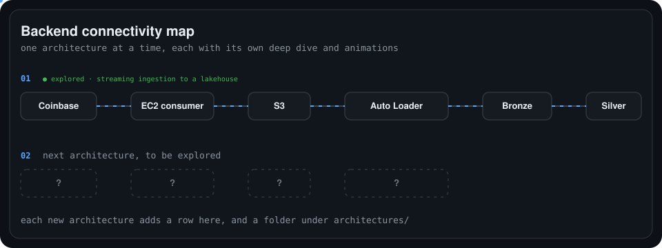

# backend-architecture-deep-dives

A learning repo for exploring backend architectures **one at a time, in depth**. Each architecture gets its own folder with a deep-dive write-up and animated diagrams of how every component connects: protocols, security, rules, failure handling and cadence.

    

## Architectures

| # | Architecture | Status |
| --- | --- | --- |
| 01 | [Streaming ingestion to a lakehouse](architectures/01-streaming-ingestion-to-lakehouse/README.md) (Coinbase → EC2 → S3 → Databricks) | ✅ Explored, built and running |

New rows are added as each architecture is explored.

## How each deep dive is structured

Every architecture folder follows [architectures/_template](architectures/_template/README.md):

1. **Overview**: the whole flow in one animated diagram.
2. **Connections**: one row per hop, with protocol, security, rules and cadence.
3. **Deep dives**: one section per tricky component, each with its own animation.
4. **Failure modes**: what breaks, how it is detected, how it recovers.
5. **Scale-up path**: where the design stops fitting and what replaces it.

## Adding an architecture

1. Copy `architectures/_template` to `architectures/NN-short-name`.
2. Put animated SVGs in its `animations/` folder and embed them in its README.
3. Add a row to the table above and a row to `assets/hub.svg`.

## Conventions

- Animations are dark-theme SVGs using SMIL or CSS, with `prefers-reduced-motion` respected, so they play inside GitHub READMEs without JavaScript.
- Numbered badges on a diagram match the rows of the connections table.
- Claims are limited to what was built or verified. Designs that are not built are labelled as designs, and numbers are approximate.
